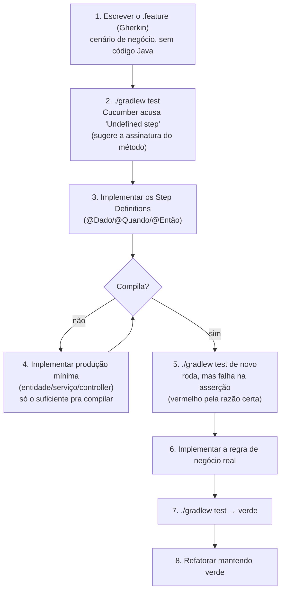

# workbox-api

Backend REST do [monorepo `workbox`](../README.md) — API de autenticação/usuários.
Sobe isolado (nativo via `bootRun` ou containerizado via `Dockerfile`); não serve o
frontend [`workbox-app`](../workbox-app/README.md), que roda standalone à parte.

Também espelhado no [GitHub](https://github.com/juniiorliimatt/workbox-api) — todo push
pro GitLab é replicado automaticamente via git hook. Ver
[README raiz](../README.md#espelho-no-github--git-hooks).

## Stack

| Camada | Tecnologia |
|---|---|
| Linguagem / runtime | Java 25 LTS (toolchain Gradle) |
| Framework | Spring Boot 3.5.16 |
| Build | Gradle 9.7.1 |
| Persistência | Spring Data JPA + Hibernate, Liquibase (migrations) |
| Banco | PostgreSQL (dev/prod), H2 em memória (test) |
| Segurança | Spring Security 6 + JWT (`io.jsonwebtoken`), OAuth2 resource server/client |
| Hypermedia | Spring HATEOAS |
| Documentação de API | springdoc-openapi (Swagger UI + contrato versionado) |
| Cobertura | JaCoCo |
| Análise estática | SonarQube/SonarCloud |

## Estrutura de pacotes

```
br.com.workbox
├── config/            Configuração geral (OpenAPI, JPA auditing, servir o frontend)
├── core/               Anotações/utilitários compartilhados
├── exceptions/         Exceções de domínio + handler global (RestExceptionHandler)
└── security/
    ├── config/         Spring Security, CORS, JWT filter
    ├── controllers/     AuthController, UserApiController
    ├── dto/             DTOs de entrada/saída
    ├── entities/         UserApi, Role
    ├── repositories/     Spring Data JPA
    └── services/         JwtService, UserApiService
```

## Rodando localmente

Profiles disponíveis (`spring.profiles.active`):

| Profile | Banco | Uso |
|---|---|---|
| `test` | H2 em memória, schema criado via Hibernate (`ddl-auto=create-drop`) | Testes automatizados, geração do contrato OpenAPI — não precisa de Postgres |
| `dev` (default) | PostgreSQL local via `DATABASE_URL` (default `jdbc:postgresql://localhost:5432/workbox`) | Desenvolvimento — schema via Liquibase |
| `prod` | PostgreSQL via `DATABASE_URL` (obrigatório) | Deploy |

```bash
./gradlew bootRun                                    # profile dev, exige Postgres local
./gradlew bootRun --args='--spring.profiles.active=test'  # sem dependência externa
```

Variáveis de ambiente relevantes: `PORT` (default 8080), `JWT_SECRET`, `DATABASE_URL`,
`POSTGRES_USER`/`POSTGRES_PASSWORD` (default `workbox_service`/`workbox_service` — role
restrito ao schema `workbox`, não o superusuário), `SCHEMA` (default
`workbox`), `admin.password`.

Postgres local sobe via `docker-compose.yml` na raiz do monorepo (ver [README
raiz](../README.md#rodando-localmente)) na porta **5433**, não 5432 — passe
`DATABASE_URL=jdbc:postgresql://localhost:5433/workbox`. Banco único (`workbox`)
compartilhado com os outros microserviços — cada um isolado no seu próprio schema, sem
acesso entre eles (ver [README raiz](../README.md#rodando-localmente)).

O Liquibase (`db/changelog/`) já semeia dois usuários (`admin`, `USER`/`ADMIN` roles) e
`user` para desenvolvimento local.

## Autenticação

Todas as rotas são versionadas em path (`/api/v1/...`) desde o início — evita quebrar
clients existentes no dia em que um contrato precisar de uma versão nova em paralelo.

Login é sempre por **email** (não username) — `UserApi.getUsername()` (contrato do Spring
Security) devolve o email. `socialName` é só um campo de exibição livre ("como quer ser
chamado", usado pelo front), sem unicidade.

JWT via `POST /api/v1/auth/login` (retorna `access_token` + `refresh_token`) e
`POST /api/v1/auth/refresh`. Endpoints protegidos exigem `Authorization: Bearer <token>`.

| Endpoint | Auth | O quê |
|---|---|---|
| `POST /api/v1/auth/register` | público | Auto-cadastro — sempre atribui a role USER no servidor, nunca aceita role do payload |
| `POST /api/v1/auth/login` | público | Rate limit 10/min por IP; 5 tentativas erradas trava a conta por 15min (auto-expira) |
| `POST /api/v1/auth/refresh` | público | Rotação de refresh token (uso único) — reapresentar um já usado revoga a família inteira (reuso = token roubado) |
| `POST /api/v1/auth/logout` | Bearer | Incrementa `tokenVersion` — revoga todo token emitido antes |
| `GET /api/v1/auth/me` | Bearer | Dados do usuário autenticado |
| `PUT /api/v1/auth/password` | Bearer | Troca de senha, exige a senha atual |
| `POST /api/v1/auth/forgot-password` | público | Sempre 204 (não revela se o e-mail existe); token de 30min, uso único; rate limit por e-mail |
| `POST /api/v1/auth/reset-password` | público | Consome o token do e-mail, seta nova senha |
| `POST /api/v1/auth/mfa/enroll` | Bearer | Gera segredo TOTP novo (não habilita MFA ainda) |
| `POST /api/v1/auth/mfa/verify` | Bearer | Confirma o primeiro código TOTP e habilita MFA na conta |
| `POST /api/v1/auth/mfa/disable` | Bearer | Desabilita MFA, exige um código TOTP válido |
| `POST /api/v1/auth/mfa/login` | público | 2ª etapa do login quando a conta tem MFA: troca `mfa_token` (5min) + código TOTP por access+refresh |
| `GET/POST/PUT/DELETE /api/v1/role` | Bearer (escrita = ADMIN) | CRUD de roles, exclusão lógica |

Conta com MFA habilitado: `POST /auth/login` responde `200` com `{"mfa_required": true, "mfa_token": "..."}`
em vez dos tokens — o client chama `POST /auth/mfa/login` com esse `mfa_token` + o código de
6 dígitos do app autenticador pra receber `access_token`/`refresh_token`. Segredo TOTP fica
em texto plano no banco (`users_api.mfa_secret`) por simplicidade de projeto de estudo — um
ambiente real cifraria isso em repouso.

**Login social** (Google) fica inativo até `SPRING_SECURITY_OAUTH2_CLIENT_REGISTRATION_GOOGLE_CLIENT_ID`/`_CLIENT_SECRET`
serem setados como variável de ambiente — sem isso, nem o bean existe, zero impacto na
subida da aplicação.

Toda tentativa de login (sucesso ou falha) fica em `login_audit`. Mudanças em `UserApi`/
`Role` ficam versionadas via Hibernate Envers (`users_api_aud`/`roles_aud` + `rev_info`,
quem mudou vem do `SecurityContext`).

## Observabilidade

- Erros seguem RFC 7807 (`ProblemDetail`) — mesmo shape (`type/title/status/detail/instance`)
  em toda a API, incluindo um handler catch-all pra qualquer exceção não mapeada (nunca
  cai no whitelabel error do Spring, que poderia vazar stack trace).
- Toda requisição carrega um `X-Request-Id` (gerado ou propagado do client) via MDC —
  aparece em todo log da requisição, correlacionável com o mesmo header repassado a um
  resource server downstream (ex.: budget-service).
- `/actuator/prometheus` exposto junto com `/actuator/health` (métricas Micrometer) —
  aberto por conveniência de estudo/scrape local; num ambiente real, restringir pela rede
  de origem em vez de deixar público.

## Contrato de API (OpenAPI)

`openapi/openapi.yaml` é o contrato REST versionado desta API — fonte da verdade para
qualquer client (frontend `workbox-app`, agentes de IA) que a consuma. Não assuma
comportamento de endpoint que não esteja descrito nesse arquivo.

**Regra**: qualquer mudança de contrato (novo endpoint, novo campo, mudança de schema)
exige regenerar e commitar o arquivo junto com a mudança de código. O job
`contract-drift-check` do CI falha o pipeline se o arquivo commitado divergir do gerado
a partir do código.

Para regenerar localmente:

```bash
./gradlew generateOpenApiDocs
git diff openapi/openapi.yaml
```

A task sobe a aplicação com o profile `test` (H2 em memória, sem dependência de
Postgres), baixa `/v3/api-docs.yaml` e grava em `openapi/openapi.yaml`. Com o app
rodando, o Swagger UI fica em `/swagger-ui/index.html`.

Ver também: [AGENTS.md](../AGENTS.md), que descreve como este contrato alinha o
desenvolvimento entre o agente de backend (Claude Code) e o de frontend (Antigravity).

## Testes

```bash
./gradlew check          # testes + JaCoCo
./gradlew jacocoTestReport   # relatório em build/jacocoHtml
```

JUnit 5 + Spring Boot Test + MockMvc. `ApiControllerTestConfig` sobrescreve
intencionalmente os beans de segurança (`spring.main.allow-bean-definition-overriding=true`
no profile `test`) para isolar os testes de controller do fluxo real de
autenticação/DB.

### BDD com Cucumber: fluxo de implementação

`./gradlew test` já roda os `.feature` junto (JUnit Platform descobre `RunCucumberTest`
via `@Suite`/`@IncludeEngines("cucumber")`, sem task separada). Exemplo real:
[`authentication.feature`](src/test/resources/features/authentication.feature) +
[`AuthenticationSteps.java`](src/test/java/br/com/workbox/steps/AuthenticationSteps.java).

Ordem de implementação — outside-in, feature primeiro, produção por último:



Por que nessa ordem: o `.feature` fixa o comportamento esperado *antes* de qualquer
linha de produção existir — força a implementação a servir o cenário, não o contrário.
Os passos 3→5 costumam expor rapidamente lacunas de design (step precisa de um método
que não existe, DTO que falta um campo) antes de qualquer lógica de negócio ser escrita.

## CI/CD

`.gitlab-ci.yml`: `test` (build + testes) → `contract-drift-check` (contrato em dia) →
`build` (empacota o JAR). `sonarcloud-check` roda análise estática em MRs e nas branches
`main`/`develop`.

## Deploy

Só a API neste artefato — `workbox-app` sobe separado (nativo ou em container próprio,
ver [README raiz](../README.md#rodando-tudo-em-containers)). `Procfile`/
`system.properties` configuram deploy estilo Heroku (JDK 25); `Dockerfile` (multi-stage,
non-root) pra deploy containerizado.

## Referências

* [Spring Boot Gradle Plugin](https://docs.spring.io/spring-boot/gradle-plugin) ·
  [Spring Data JPA](https://spring.io/guides/gs/accessing-data-jpa/) ·
  [Spring Security](https://spring.io/guides/gs/securing-web/) ·
  [Spring HATEOAS](https://spring.io/guides/gs/rest-hateoas/) ·
  [Liquibase](https://docs.spring.io/spring-boot/reference/howto/data-initialization.html#howto.data-initialization.migration-tool.liquibase) ·
  [springdoc-openapi](https://springdoc.org/)
